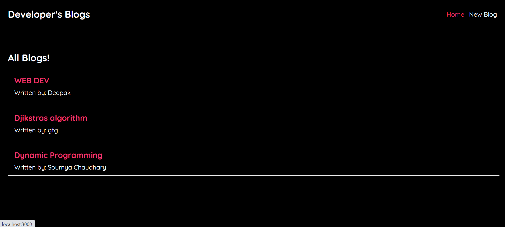
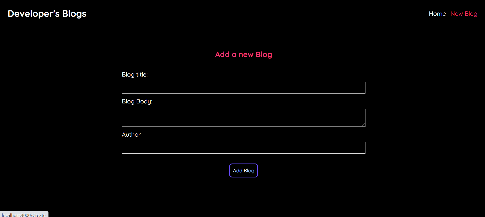
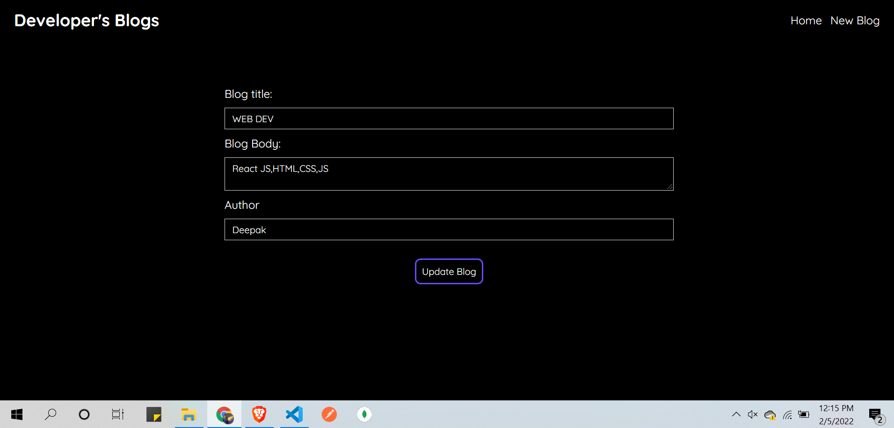

# Blog-Spot is React based web-application to manage Blogs.  
## Tech Used:  
###     Javascript  
###     React  
###     HTML & CSS  
  
## JSON is used as a database to store blogs.
## We can perform Create, Read, Delete and Update operations on blogs.

## Home page with List of all Blogs.

## Add a new Blog.

## Update a present Blog.

